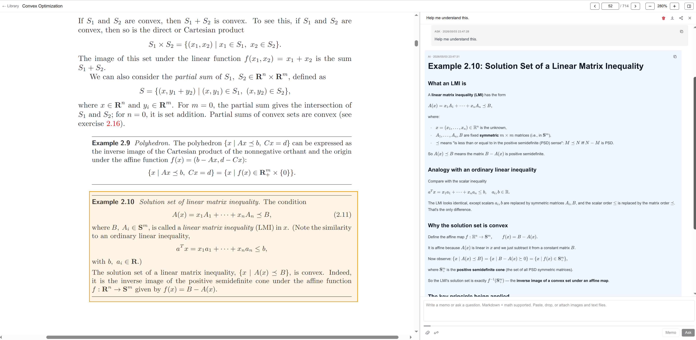

# oh-book-reader

A single-user PDF reader with Claude-powered Q&A on selected regions. Open a PDF, draw a box around any text/figure/equation across one or more pages, and ask Claude follow-up questions about that excerpt — answers render with KaTeX math, Mermaid diagrams, GFM tables and code, and you can attach images in the composer. Everything lives on the local filesystem under `./data/` — no database.



## Prerequisites

- **Node.js 20+** (developed on v22).
- **npm**.
- **Anthropic Claude Code CLI**, logged into a Claude Max or Pro subscription. The app authenticates by reusing the OAuth session in `~/.claude/`; there is no in-app API-key flow.
  ```bash
  npm install -g @anthropic-ai/claude-code
  claude login
  ```

## Setup

```bash
git clone <this-repo> oh-book-reader
cd oh-book-reader
npm install
```

`npm install` runs a `postinstall` step that copies the PDF.js worker to `public/pdf.worker.min.mjs`. **Do not pass `--ignore-scripts`** — without that file, in-browser PDF rendering breaks.

### Optional: `.env.local`

The app finds the `claude` binary automatically — first via the bundled glibc/musl SDK binaries, then via `which claude` (see `lib/claude.ts:30-57`). You only need `.env.local` in the rare case that resolution fails and `npm run dev` reports `Claude Code native binary not found`. Then create `.env.local` pointing at your `claude` executable:

```bash
# .env.local
CLAUDE_CODE_PATH=/absolute/path/to/claude
```

Find the path with `which claude`. For an nvm-managed install it usually looks like `~/.nvm/versions/node/<version>/lib/node_modules/@anthropic-ai/claude-code/bin/claude`. See `lib/claude.ts` for how this is consumed.

## Run

```bash
npm run dev          # http://localhost:3000
npm run build && npm start   # production build
```

## Verify Claude is wired up

```bash
npx tsx scripts/smoke-claude.ts
```

It should stream `pong` and finish with `[OK] sessionId: …`. If it fails, `claude login` is missing or expired, or the executable can't be located — set `CLAUDE_CODE_PATH` (see above).

## Data & storage

All state — uploaded PDFs, page selections, rendered region images, and conversations — lives under `./data/books/<book_id>/`:

```
data/books/<book_id>/
  meta.json              # title, page count, upload time
  book.pdf               # the original PDF
  selections/<sel_id>.json + <sel_id>_<page>.png
  conversations/<conv_id>.json
```

(In the UI these conversations are surfaced as **threads** — same thing, two names.)

The directory is created on first upload. To wipe all state, delete `./data/`.

## A note on Next.js

This project runs on Next.js 16, whose conventions differ from earlier versions. If you're modifying app code, consult `node_modules/next/dist/docs/` (and see `CLAUDE.md`) before relying on memory of older Next.js APIs.
