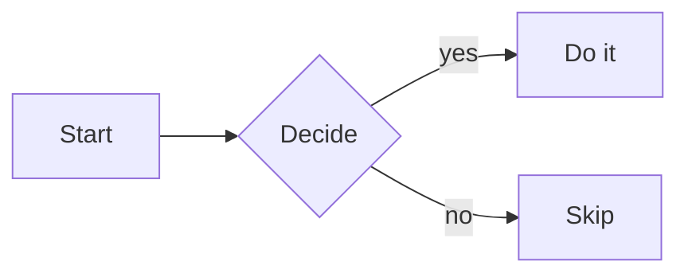

# Plan: Block-level copy buttons in thread view

## Context

In thread view, the only existing copy affordance is a per-message button (`components/CopyButton.tsx`, used in `components/ConversationPanel.tsx:2269` and `:2302`) that copies the entire raw markdown of a message. Users can't easily grab just a code block, math formula, SVG, or mermaid diagram — selecting rendered KaTeX/mermaid/SVG with the mouse produces garbage or doesn't work at all. The fix: add small per-block copy buttons that copy the **source** (LaTeX, mermaid, SVG, code) — the most common need (regenerate, paste into another tool, edit and resend).

## UX pattern

**Hover-revealed copy button**, top-right of each block (GitHub / Claude.ai pattern), reusing `components/CopyButton.tsx` verbatim. Visibility classes: `opacity-0 group-hover:opacity-100 focus-within:opacity-100 [@media(hover:none)]:opacity-100` so touch users always see it. No new colors — `CopyButton` already uses neutral `text-zinc-500`, which honors the saved memory note about reusing existing styling.

## Per-block-type implementation

### Code blocks — `components/MathMarkdown.tsx`

In the existing `pre` override (lines 46-62), after the mermaid/svg branches, replace the fallback `return <pre {...rest}>{children}</pre>` with a `<div class="relative group not-prose my-2">` wrapping the `<pre>` plus an absolutely positioned `CopyButton` (`absolute right-1 top-1`).

Source extraction: walk `childEl.props.children` recursively to a string. After `rehype-highlight`, `<code>`'s children are a tree of `<span>` token elements whose leaves are strings — a small `nodeToText` helper (recurse arrays / `props.children`, return strings as-is) is sufficient. No refs, no plugin. Skip-wrap when there is no `language-*` class to avoid decorating the bare `<pre>` that mermaid/svg child components emit during loading.

### Mermaid — `components/MermaidDiagram.tsx`

Wrap each return (loading at line 58-64, err at 65-74, ok at 75-80) in a `<div class="relative group">`, add `<CopyButton text={code} title="Copy mermaid source" className="absolute right-1 top-1 opacity-0 group-hover:opacity-100 focus-within:opacity-100 [@media(hover:none)]:opacity-100" />`. Source-only — no copy-rendered-SVG button.

### SVG — `components/SvgBlock.tsx`

Same pattern as mermaid (loading at 35-41, err at 42-51, ok at 52-57). `<CopyButton text={code} title="Copy SVG source" />`. Source-only.

### Display math — `components/MathMarkdown.tsx`

**Approach: read LaTeX from KaTeX's own MathML annotation.** `rehype-katex` defaults to `output: 'htmlAndMathml'`, which emits `<annotation encoding="application/x-tex">…raw LaTeX…</annotation>` inside the rendered tree. The source is already in the DOM — no rehype/remark plugin needed.

Add a `span` component override: detect when `node.properties.className` includes `'katex-display'` (KaTeX's wrapper class for display mode), then render `<span class="relative group block">{children}<MathCopyButton …/></span>`. `MathCopyButton` takes a ref to its parent, on click runs `parent.querySelector('annotation[encoding="application/x-tex"]')?.textContent` to read the LaTeX, then delegates to clipboard. If the annotation is missing (e.g., if rehype-katex is ever switched to `output: 'html'`), the button is rendered disabled. Add a comment on the `rehypeKatex` plugin line warning not to set `output: 'html'`.

`MathCopyButton` is a ~25-line local component in `MathMarkdown.tsx` (no new file).

### Inline math — `components/MathMarkdown.tsx`

Same `span` override path — when `className` includes `'katex'` but **not** `'katex-display'`, wrap in `<span class="relative inline-block group">` and append a tiny copy button positioned `absolute -top-3 right-0` so the button floats above the line **outside** the text flow (no reflow on hover). Reuse the same MathML-annotation read logic. Hidden by `opacity-0 group-hover:opacity-100`.

## File-level changes

| File | Change |
|---|---|
| `components/MathMarkdown.tsx` | Add `nodeToText` helper. Extend `pre` override to wrap fallback `<pre>` with `relative group` + `CopyButton`. Add `span` override to wrap `katex-display` and `katex` (inline) spans with copy affordance. Add local `MathCopyButton` component (reads `annotation[encoding="application/x-tex"]` from a parent ref). |
| `components/MermaidDiagram.tsx` | Wrap all three return branches (loading/err/ok) in `relative group` div; add `CopyButton text={code}`. |
| `components/SvgBlock.tsx` | Wrap all three return branches in `relative group` div; add `CopyButton text={code}`. |
| `components/CopyButton.tsx` | **No change.** Reuse via `className` prop. |

No new files.

## Risks / open questions

- **rehype-katex `data-*` survival**: rehype-katex splices the math element out, so any data-attrs added by an upstream plugin would be lost. Resolved by reading the rendered MathML annotation instead.
- **`prose` styling on absolute children**: `@tailwindcss/typography` adds margins to `<pre>`, not to wrapping `<div>`s. Use `not-prose` on the code-block wrapper if any unwanted prose margin slips in. Button offset `top-1 right-1` clears `<pre>`'s default padding.
- **Touch discoverability**: covered by `[@media(hover:none)]:opacity-100`.
- **Streaming path**: in streaming mode, mermaid/svg fences fall through to plain `<pre language-mermaid|language-svg>`. The code-block wrapper still attaches and copies the in-progress fence text — acceptable.
- **`katex-display` class detection**: react-markdown passes `node` to component overrides; `node.properties.className` is an array — check membership directly, don't string-match.
- **Inline math button positioning**: `-top-3 right-0` floats the button above the baseline. Verify it doesn't visually clip when the math is on the first line of a message (parent has `padding p-2` at `ConversationPanel.tsx:2286-2291`, so there's room).
- **Annotation-element reachability**: `<annotation>` lives inside `<semantics>` inside `<math>`, often inside an `aria-hidden` MathML subtree. `Element.querySelector` reaches it regardless of `aria-hidden`; `.textContent` works across subtrees.

## Verification

Start dev server, open any thread, send a user message containing all four block types:

````markdown
Code:

```ts
function add(a: number, b: number) {
  return a + b;
}
```

Display math:

$$
\int_0^\infty e^{-x^2}\,dx = \frac{\sqrt{\pi}}{2}
$$

Inline math: $E = mc^2$ in the middle of a sentence.

Mermaid:



SVG:

```svg
<svg xmlns="http://www.w3.org/2000/svg" viewBox="0 0 60 60"><circle cx="30" cy="30" r="20" fill="tomato"/></svg>
```
````

Verify:

1. Hover each rendered block — copy button appears top-right (or above-right for inline math).
2. Click → checkmark flashes for 1.5s.
3. Paste into a text editor:
   - code → TS source verbatim
   - display math → `\int_0^\infty e^{-x^2}\,dx = \frac{\sqrt{\pi}}{2}`
   - inline math → `E = mc^2`
   - mermaid → `graph LR…` source
   - SVG → `<svg…>…</svg>` source
4. With DevTools touch emulation (or on a touch device), buttons are visible without hover.
5. Streaming path: send a long AI response containing these blocks; during streaming, mermaid/svg fences render as `<pre>` with a working copy button; after stream ends, they re-render as diagrams with their own copy button.
6. Existing message-level `CopyButton` at `ConversationPanel.tsx:2269` and `:2302` still works (no regression).

## Critical files

- `/home/ohhara/work/oh-book-reader/components/MathMarkdown.tsx`
- `/home/ohhara/work/oh-book-reader/components/MermaidDiagram.tsx`
- `/home/ohhara/work/oh-book-reader/components/SvgBlock.tsx`
- `/home/ohhara/work/oh-book-reader/components/CopyButton.tsx` (reuse, no edit)
